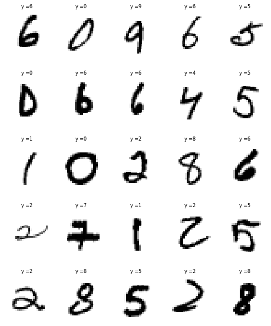
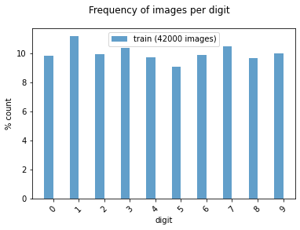

# MNIST Image Compression and Reconstruction using Autoencoders in Python 

  
  
## 1. Objectives

The objective of this project is to demonstrate how to compress and reconstruct MNIST images using Autoencoders.

## 2.  Autoencoders

Autoencoders are an unsupervised learning technique in which we leverage neural networks for the task of representation learning. Specifically, they have a network architecture, which imposes a bottleneck in the network which forces a compressed knowledge representation of the original input. If the input features were each independent of one another, this compression and subsequent reconstruction would be a very difficult task. However, if some sort of structure exists in the data (i.e. correlations between input features), this structure can be learned and consequently leveraged when forcing the input through the network's bottleneck.

We shall illustrate how to  compress and reconstruct MNIST images using Autoencoders. This can be done because image pixels are highly correlated and there is a significant amount of redundancy, which can be encoded and compressed by the autoencoder while generating reasonably good quality reconstructions.

## 3. Data

We shall illustrate the PCA representation of the  MNIST database of handwritten digits, available from this page, which has a training set of 42,000 examples, and a test set of 18,000 examples. We shall illustrate sample images from this data sets in the next section.

## 4. Development

* Project: MNIST Dataset Image Compression and Reconstruction using Autoencoders:
* The objective of this project is to demonstrate how to compress and reconstruct MNIST images using Autoencoders.

* Author: Mohsen Ghazel (mghazel)
* Date: April 9th, 2021

### 4.1. Part 1: Python imports and global variables:

#### 4.1.1. Standard scientific Python imports:

<pre style="color:#000020;background:#e6ffff;font-size:10px;line-height:1.5;">#------------------------------------------------------
# Python imports and environment setup
#------------------------------------------------------
# opencv
import cv2
# numpy
import numpy as np
# matplotlib
import matplotlib.pyplot as plt

# import tansorflow
#----------------------------------
# Importing: Tensorflow 2.0 
# resulted in the following error:
#---------------------------------
# AttributeError: module 'tensorflow' 
# has no attribute 'placeholder'
#---------------------------------
# import tensorflow as tf
#---------------------------------
# We need to revert to using 
# Tensorflow ver 1.x
#---------------------------------
import tensorflow.compat.v1 as tf
tf.disable_v2_behavior() 
#---------------------------------
# import additional functionalities
from __future__ import print_function, division
from builtins import range, input

# import shuffle  from sklearn
from sklearn.utils import shuffle

# import pandas
import pandas as pd

# random number generators values
# seed for reproducing the random number generation
from random import seed
# random integers: I(0,M)
from random import randint
# random standard unform: U(0,1)
from random import random
# time
import datetime
# I/O
import os
# sys
import sys

# display figure within the notebook
%matplotlib inline

#------------------------------------------------------
# Test imports and display package versions
#------------------------------------------------------
# Testing the OpenCV version
print("OpenCV : ",cv2.__version__)
# Testing the numpy version
print("Numpy : ",np.__version__)

OpenCV :  3.4.8
Numpy :  1.19.2
</pre>

#### 4.1.2. Global variables:

<pre style="color:#000020;background:#e6ffff;font-size:10px;line-height:1.5;"># set the random_state seed = 100 for reproducibilty
random_state_seed = 100

# the number of visualized images
num_visualized_images = 25
</pre>

### 4.2. Part 2: Load MNIST Dataset:

* We use the MINIST dataset, which was downloaded from the following link:

  * Kaggle: Digit Recognizer: https://www.kaggle.com/c/digit-recognizer/data
  * The data files train.csv and test.csv contain gray-scale images of hand-drawn digits, from zero through nine.
  * Each image is 28 pixels in height and 28 pixels in width, for a total of 784 pixels in total. Each pixel has a single pixel-value associated with it, indicating the lightness or darkness of that pixel, with higher numbers meaning darker. This pixel-value is an integer between 0 and 255, inclusive.
  * The training data set, (train.csv), has 785 columns. The first column, called "label", is the digit that was drawn by the user. The rest of the columns contain the pixel-values of the associated image.
  * Each pixel column in the training set has a name like pixelx, where x is an integer between 0 and 783, inclusive. To locate this pixel on the image, suppose that we have decomposed x as x = i * 28 + j, where i and j are integers between 0 and 27, inclusive. Then pixelx is located on row i and column j of a 28 x 28 matrix, (indexing by zero)

#### 4.2.1. Load and normalize the training data set:

<pre style="color:#000020;background:#e6ffff;font-size:10px;line-height:1.5;"># read the training data set
data = pd.read_csv('../large_files/train.csv').values.astype(np.float32)
# normalize the training data to [0,1]:
x_train = data[:, 1:] / 255
# format the class type to integer
y_train = data[:, 0].astype(np.int32)
# shuffle the data
x_train, y_train = shuffle(x_train, y_train)

#------------------------------------------------------
# Display a summary of the training data:
#------------------------------------------------------
# the number of training images
num_train_images = x_train.shape[0]
print("----------------------------------------------")
print("Training data:")
print("----------------------------------------------")
print("x_train.shape: ", x_train.shape)
print("y_train.shape: ", y_train.shape)
print("Number of training images: ", num_train_images)
print("Image size: ", x_train.shape[1:])
print("----------------------------------------------")
print("Classes/labels:")
print("----------------------------------------------")
print('The target labels: ' + str(np.unique(y_train)))
print("----------------------------------------------")

----------------------------------------------
Training data:
----------------------------------------------
x_train.shape:  (42000, 784)
y_train.shape:  (42000,)
Number of training images:  42000
Image size:  (784,)
----------------------------------------------
Classes/labels:
----------------------------------------------
The target labels: [0 1 2 3 4 5 6 7 8 9]
----------------------------------------------
</pre>

#### 4.2.2. Visualize some of the training images and their associated targets:

##### 4.2.2.1. First implement a visualization functionality to visualize the number of randomly selected images:

<pre style="color:#000020;background:#e6ffff;font-size:10px;line-height:1.5;">"""
# A utility function to visualize multiple images:
"""
def visualize_images_and_labels(num_visualized_images = 25, dataset_flag = 1):
  """To visualize images.

&nbsp;&nbsp;&nbsp;&nbsp;&nbsp;&nbsp;Keyword arguments:
&nbsp;&nbsp;&nbsp;&nbsp;&nbsp;&nbsp;&nbsp;&nbsp;&nbsp;- num_visualized_images -- the number of visualized images (deafult 25)
&nbsp;&nbsp;&nbsp;&nbsp;&nbsp;&nbsp;&nbsp;&nbsp;&nbsp;- dataset_flag -- 1: training dataset, 2: test dataset
&nbsp;&nbsp;&nbsp;&nbsp;&nbsp;&nbsp;Return:
&nbsp;&nbsp;&nbsp;&nbsp;&nbsp;&nbsp;&nbsp;&nbsp;&nbsp;- None
&nbsp;&nbsp;"""
  #--------------------------------------------
  # the suplot grid shape:
  #--------------------------------------------
  num_rows = 5
  # the number of columns
  num_cols = num_visualized_images // num_rows
  # setup the subplots axes
  fig, axes = plt.subplots(nrows=num_rows, ncols=num_cols, figsize=(8, 10))
  # set a seed random number generator for reproducible results
  seed(random_state_seed)
  # iterate over the sub-plots
  for row in range(num_rows):
      for col in range(num_cols):
        # get the next figure axis
        ax = axes[row, col];
        # turn-off subplot axis
        ax.set_axis_off()
        #--------------------------------------------
        # if the dataset_flag = 1: Training data set
        #--------------------------------------------
        if ( dataset_flag == 1 ): 
          # generate a random image counter
          counter = randint(0,num_train_images)
          # get the training image
          image = np.squeeze(x_train[counter,:])
          # get the target associated with the image
          label = y_train[counter]
        #--------------------------------------------
        # dataset_flag = 2: Test data set
        #--------------------------------------------
        else: 
          # generate a random image counter
          counter = randint(0,num_test_images)
          # get the test image
          image = np.squeeze(x_test[counter,:])
          # get the target associated with the image
          label = y_test[counter]
        #--------------------------------------------
        # display the image
        #--------------------------------------------
        ax.imshow(image.reshape(28,28), cmap=plt.cm.gray_r, interpolation='nearest')
        # set the title showing the image label
        ax.set_title('y =' + str(label), size = 8)
</pre>

##### 4.2.2.2. Call the function to visualize the randomly selected training images:

<pre style="color:#000020;background:#e6ffff;font-size:10px;line-height:1.5;"># the number of selected training images
num_visualized_images = 25
# call the function to visualize the training images
visualize_images_and_labels(num_visualized_images, 1)
</pre>

 
 
 #### 4.2.3. Examine the number of images for each class of the training and testing subsets:
 
 <pre style="color:#000020;background:#e6ffff;font-size:10px;line-height:1.5;"># create a histogram of the number of images in each class/digit:
def plot_bar(y, loc='left', relative=True):
    width = 0.35
    if loc == 'left':
        n = -0.5
    elif loc == 'right':
        n = 0.5
     
    # calculate counts per type and sort, to ensure their order
    unique, counts = np.unique(y, return_counts=True)
    sorted_index = np.argsort(unique)
    unique = unique[sorted_index]
     
    if relative:
        # plot as a percentage
        counts = 100*counts[sorted_index]/len(y)
        ylabel_text = '% count'
    else:
        # plot counts
        counts = counts[sorted_index]
        ylabel_text = 'count'
         
    xtemp = np.arange(len(unique))
    plt.bar(xtemp + n*width, counts, align='center', alpha=.7, width=width)
    plt.xticks(xtemp, unique, rotation=45)
    plt.xlabel('digit')
    plt.ylabel(ylabel_text)
 
plt.suptitle('Frequency of images per digit')
plot_bar(y_train, loc='left')
plt.legend([
    'train ({0} images)'.format(len(y_train))
]);
</pre>
 
 
 
### 4.3. Part 3: Implement and train Autoencoder:

#### 4.3.1. Implement the Autoencoder class:

<pre style="color:#000020;background:#e6ffff;font-size:10px;line-height:1.5;">class Autoencoder:
  def __init__(self, D, M):
    """
&nbsp;&nbsp;&nbsp;&nbsp;Autoencoder constructor
&nbsp;&nbsp;&nbsp;&nbsp;"""
    # represents a batch of training data
    self.X = tf.placeholder(tf.float32, shape=(None, D))

    # input -&gt; hidden
    self.W = tf.Variable(tf.random_normal(shape=(D, M)) * np.sqrt(2.0 / M))
    self.b = tf.Variable(np.zeros(M).astype(np.float32))

    # hidden -&gt; output
    self.V = tf.Variable(tf.random_normal(shape=(M, D)) * np.sqrt(2.0 / D))
    self.c = tf.Variable(np.zeros(D).astype(np.float32))

    # construct the reconstruction
    self.Z = tf.nn.relu(tf.matmul(self.X, self.W) + self.b)
    logits = tf.matmul(self.Z, self.V) + self.c
    self.X_hat = tf.nn.sigmoid(logits)

    # compute the cost
    self.cost = tf.reduce_sum(
      tf.nn.sigmoid_cross_entropy_with_logits(
        labels=self.X,
        logits=logits
      )
    )

    # create the trainer
    self.train_op = tf.train.RMSPropOptimizer(learning_rate=0.001).minimize(self.cost)

    # set up session and variables for later
    self.init_op = tf.global_variables_initializer()
    self.sess = tf.InteractiveSession()
    self.sess.run(self.init_op)

  def fit(self, X, epochs=30, batch_sz=64):
    """
&nbsp;&nbsp;&nbsp;&nbsp;Fit the model
&nbsp;&nbsp;&nbsp;&nbsp;"""
    costs = []
    n_batches = len(X) // batch_sz
    print("-----------------------------")
    print("n_batches:", n_batches)
    for i in range(epochs):
      print("-----------------------------")
      print("epoch:", i)
      print("-----------------------------")
      np.random.shuffle(X)
      for j in range(n_batches):
        batch = X[j*batch_sz:(j+1)*batch_sz]
        _, c, = self.sess.run((self.train_op, self.cost), feed_dict={self.X: batch})
        c /= batch_sz 
        costs.append(c)
        # display the cost for selected epochs
        if j % 200 == 0:
          print("iter: %d, cost: %.3f" % (j, c))
    print("-----------------------------")
    print('Training completed successfully!')
    print("-----------------------------")
    #----------------------------------------
    # display the cost/function as a function 
    # of the epochs
    #----------------------------------------
    # create a figure and set its axis
    fig_size = (8,5)
    # create the figure 
    plt.figure(figsize=fig_size)
    plt.plot(costs)
    plt.title("Training lossas function of the epoch number", fontsize = 12)
    plt.xlabel("Epoch number", fontsize = 12)
    plt.ylabel("Loss", fontsize = 12)
    plt.show()
        
  def predict(self, X):
    """
&nbsp;&nbsp;&nbsp;&nbsp;Generate Autoencoder reconstruction of the input X
&nbsp;&nbsp;&nbsp;&nbsp;"""
    return self.sess.run(self.X_hat, feed_dict={self.X: X})
</pre>

#### 4.3.2. Instantiate and fit the Autoencoder:

<pre style="color:#000020;background:#e6ffff;font-size:10px;line-height:1.5;"># Instantiate the Autoencoder
model = Autoencoder(784, 300)
# Fit the Autoencoder to the training data and plot the loss/cost function
model.fit(x_train)

-----------------------------
n_batches: 656
-----------------------------
epoch: 0
-----------------------------
iter: 0, cost: 562.033
iter: 200, cost: 88.770
iter: 400, cost: 70.945
iter: 600, cost: 63.730
-----------------------------
epoch: 1
-----------------------------
iter: 0, cost: 63.642
iter: 200, cost: 62.351
iter: 400, cost: 60.547
iter: 600, cost: 58.097
-----------------------------
.............................
-----------------------------
epoch: 28
-----------------------------
iter: 0, cost: 53.676
iter: 200, cost: 51.435
iter: 400, cost: 52.713
iter: 600, cost: 51.097
-----------------------------
epoch: 29
-----------------------------
iter: 0, cost: 49.435
iter: 200, cost: 51.667
iter: 400, cost: 50.340
iter: 600, cost: 52.383
-----------------------------
Training completed successfully!
-----------------------------
</pre>

#### 4.3.3 Use the trained Autoencoder to reconstruct the input images:¶

* Randomly select input images and reconstruct them using the trained Autoencoder:

<pre style="color:#000020;background:#e6ffff;font-size:10px;line-height:1.5;"># the number of reconstructed images
num_reconstructed_images = 10
for i in range(num_reconstructed_images):
    #----------------------------------------
    # Step 1: select a random input image:
    #----------------------------------------
    i = np.random.choice(len(x_train))
    x = x_train[i]
    k = y_train[i]
    im = model.predict([x]).reshape(28, 28)
    #----------------------------------------
    # display the original and reconstructed 
    # images:
    #----------------------------------------
    # create a figure and set its axis
    fig_size = (7,3)
    # create the figure 
    plt.figure(figsize=fig_size)
    # display the sample
    plt.subplot(1,2,1)
    plt.imshow(x.reshape(28, 28), cmap='gray')
    plt.title("Original image with class: " + str(k), fontsize = 12)
    plt.axis('off')
    plt.subplot(1,2,2)
    plt.imshow(im, cmap='gray')
    plt.title("Autoencoder reconstruction", fontsize = 12)
    plt.axis('off')
    plt.show()
</pre>

<table>
  <tr>
    <td> </td>
   </tr> 
   <tr>
    <td> </td>
  </td>
  </tr>
</table>

### 4.5. Part 5: Display a successful execution message:

<pre style="color:#000020;background:#e6ffff;font-size:10px;line-height:1.5;"># display a final message
# current time
now = datetime.datetime.now()
# display a message
print('Program executed successfully on: '+ str(now.strftime("%Y-%m-%d %H:%M:%S") + "...Goodbye!\n"))

Program executed successfully on: 2021-05-10 03:29:48...Goodbye!
</pre>

## 5. Analysis

* In view of the presented results, we make the following observations:
  * The Autoencoder reconstructions of the sample MNIST training images appear the same as the original images, to the uman eye. 
  * Autoencoder yield high-quality image loss reconstructions at high compression rate. 

## 6. Future Work

* We plan to explore the following related issues:
  * To estimate the compression ratio of the encoded images as compared to the original image
  * To explore implementing Variational Auto-Encoders (V-AE) and Generative Adversarial Networks (GANs) models to images from noise.
  * These more advanced models are expected to generated reconstructed images with even higher quality.

## 7. References

1. Kaggle. (Digit Recognizer: Learn computer vision fundamentals with the famous MNIST data. https://www.kaggle.com/c/digit-recognizer/data
2. Yann LeCun et. al. THE MNIST DATABASE of handwritten digits. http://yann.lecun.com/exdb/mnist/ 
3. JEREMY JORDAN. Introduction to autoencoders. https://www.jeremyjordan.me/autoencoders/ 
4. Keras. Building Autoencoders in Keras. https://blog.keras.io/building-autoencoders-in-keras.html Aditya Sharma. Autoencoder as a 5. Classifier using Fashion-MNIST Dataset. https://www.datacamp.com/community/tutorials/autoencoder-classifier-python 
6. Arvin Singh. Kushwaha Making an Autoencoder: Using Keras and training on MNIST. https://towardsdatascience.com/how-to-make-an-autoencoder-2f2d99cd5103 
7. Tensorflow. Introduction to Autoencoders. https://www.tensorflow.org/tutorials/generative/autoencoder 
8. Soumya Ghosh. Simple Autoencoder example using Tensorflow in Python on the Fashion MNIST dataset. https://medium.com/@connectwithghosh/simple-autoencoder-example-using-tensorflow-in-python-on-the-fashion-mnist-dataset-eee63b8ed9f1 
9. Adrian Rosebrock.Autoencoders with Keras, TensorFlow, and Deep Learning. https://www.pyimagesearch.com/2020/02/17/autoencoders-with-keras-tensorflow-and-deep-learning/ 
10. mgid. Generate new MNIST digits using Autoencoderhttps://iq.opengenus.org/mnist-digit-generation-using-autoencoder/ 
11. Ali Abdelaal. Autoencoders for Image Reconstruction in Python and Keras. https://stackabuse.com/autoencoders-for-image-reconstruction-in-python-and-keras/ 
11. Jan Melchior.Autoencoder on MNIST. https://pydeep.readthedocs.io/en/latest/tutorials/AE_MNIST.html
